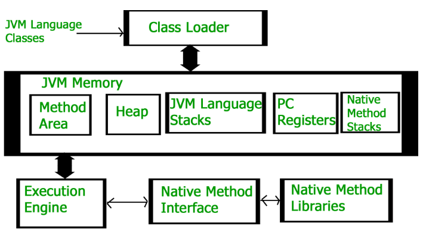
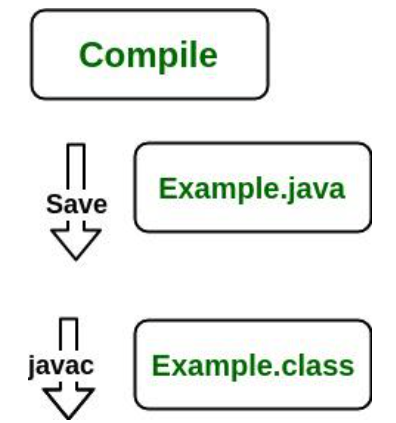
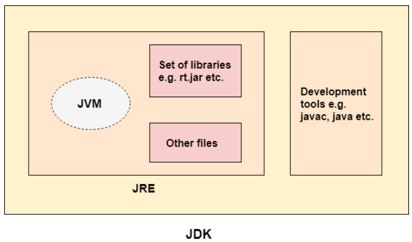

# Key Features of Java
### 1. Platform Independent
Compiler converts source code to byte code and then the JVM executes the bytecode generated by the compiler. This byte code can run on any platform be it Windows, Linux, or macOS which means if we compile a program on Windows, then we can run it on Linux and vice versa. Each operating system has a different JVM, but the output produced by all the OS is the same after the execution of the byte code. That is why we call java a platform-independent language.
### 2. Object-Oriented Programming
see more: 
- Abstraction
- Encapsulation
- Inheritance
- Polymorphism
### 3. Security
In java, we don’t have pointers, so we cannot access out-of-bound arrays i.e it shows ArrayIndexOutOfBound Exception if we try to do so.
### 4. High Performance
Java architecture is defined in such a way that it reduces overhead during the runtime and at some times java uses Just In Time (JIT) compiler where the compiler compiles code on-demand basis where it only compiles those methods that are called making applications to execute faster.

# Different between JDK, JRE, and JVM
### JVM
JVM (Java Virtual Machine) is an abstract machine. It is called a virtual machine because it doesn't physically exist. It is a specification that provides a runtime environment in which Java bytecode can be executed. It can also run those programs which are written in other languages and compiled to Java bytecode.

#### Working of JVM
It is mainly responsible for three activities. 

 - Loading
 - Linking
 - Initialization

### JRE
JRE is an acronym for Java Runtime Environment. The Java Runtime Environment is a set of software tools which are used for developing Java applications. It is used to provide the runtime environment. It is the implementation of JVM. It physically exists. It contains a set of libraries + other files that JVM uses at runtime.

#### Working of JRE
When you run a Java program, the following steps occur:

 - Class Loader: The JRE’s class loader loads the .class file containing the bytecode into memory.
 - Bytecode Verifier: The bytecode verifier checks the bytecode for security and correctness.
 - Interpreter: The JVM interprets the bytecode and executes the program.
 - Execution: The program executes, making calls to the underlying hardware and system resources as needed.

### JDK
JDK is an acronym for Java Development Kit. A software development environment which is used to develop Java applications and applets. It physically exists. It contains JRE + development tools. The JDK contains a private Java Virtual Machine (JVM) and a few other resources such as an interpreter/loader (java), a compiler (javac), an archiver (jar), a documentation generator (Javadoc), etc. to complete the development of a Java Application.

#### Working of JDK
The JDK enables the development and execution of Java programs. Consider the following process:

 - Java Source File (e.g., Example.java): You write the Java program in a source file.
 - Compilation: The source file is compiled by the Java Compiler (part of JDK) into bytecode, which is stored in a .class file (e.g., Example.class).
 - Execution: The bytecode is executed by the JVM (Java Virtual Machine), which interprets the bytecode and runs the Java program.

 

The following actions occur at runtime as listed below:
 - Class Loader
 - Byte Code Verifier
 - Interpreter
    - Execute the Byte Code
    - Make appropriate calls to the underlying hardware

| Aspect | JDK | JRE | JVM |
|  :--:  | :--:  | :--:  | :--: |
|  Purpose  | Used to develop Java applications | Used to run Java applications | Responsible for running Java code
Platform Dependency  | Platform-dependent  | Platform-dependent | Platform-Independent
Includes  | It includes development tools like (compiler) + JRE  | It includes libraries to run Java application + JVM | It runs the java byte code and make java application to work on any platform.
Use Case  | Writing and compiling Java code  | Running a Java application on a system  | Convert bytecode into native machine code.

*Note: The JVM is platform-independent, but JVM implements differently in each platform because it interacts with the native operating system and the hardware. So it is in practice, platform dependent.*

# C++ vs Java vs Python
These three programming languages are the most popular among coders in terms of competitive coding and programming. C++ of today in its efficiency, speed, and memory makes it widely popular among coders. Java is platform-independent. It continues to add considerable value to the world of software development. Python requires less typing and provides new libraries, fast prototyping, and several other new features.

### C++ Vs Java:

| TOPIC | C++ | Java |
|  :--:  | :--:  | :--:  |
|  Memory Management  | Use of pointers, structures, union | No use of pointers. Supports references, thread and interfaces. |
Libraries  | Comparatively available with low-level functionalities  | Wide range of classes for various high-level services
Multiple Inheritance  | Provide both single and multiple inheritance.  | Multiple inheritances is partially done through interfaces
Operator Overloading  | Supports operator overloading  | It doesn’t support this feature
Program Handling  | Functions and variables can reside outside classes.  | Functions and variables reside only in classes, packages are used.
Portability  | Platform dependent, must be recompiled for different platform  | Platform independent, byte code generated works on every OS.
Thread Support  | No built-in support for threads, depends on libraries.  | It has built-in thread support.

### Python Vs Java:

| TOPIC | Java | Python |
|  :--:  | :--:  | :--:  |
|  Compilation process  | Java is both compiled and interpreted language, which is first compiled and then interpreted into a byte code. | Python is an interpreted programming language |
Code Length	  | Longer lines of code as compared to python.  | 3-5 times shorter than equivalent Java programs.
Syntax Complexity  | Define particular block by curly braces, end statements by ;  | No need of semi colons and curly braces, uses indentation
Ease of typing  | Strongly typed, need to define the exact datatype of variables  | Dynamic, no need to define the exact datatype of variables.
Speed of execution  | Java is much faster than python in terms of speed.  | Expected to run slower than Java programs
Multiple Inheritance  | Multiple inheritance is partially done through interfaces  | Provide both single and multiple inheritance
